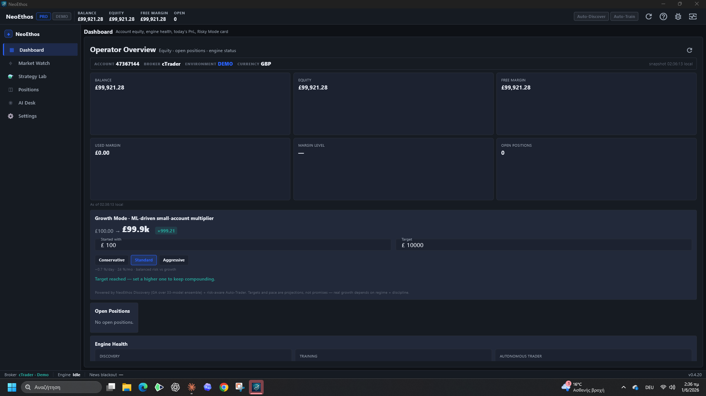
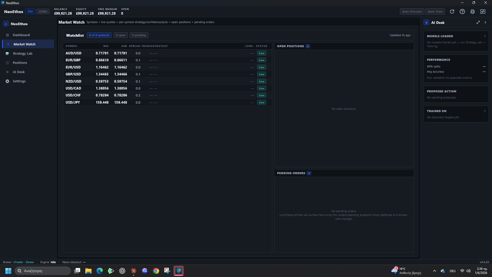
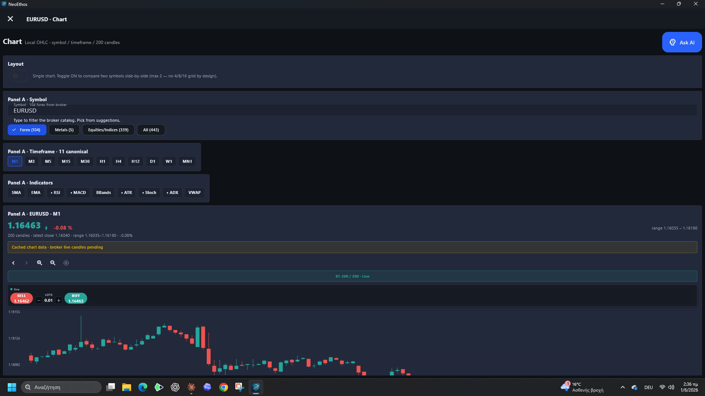
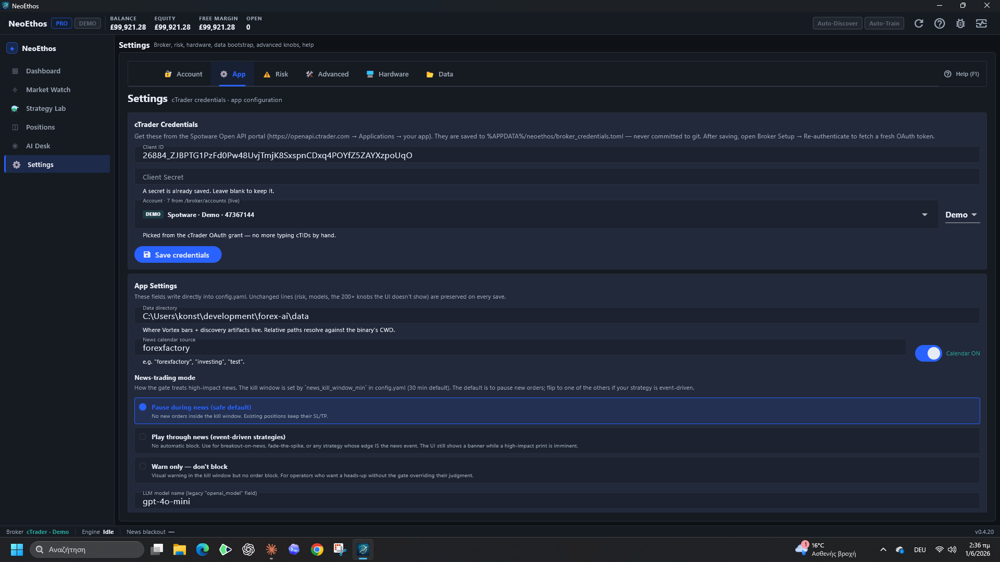
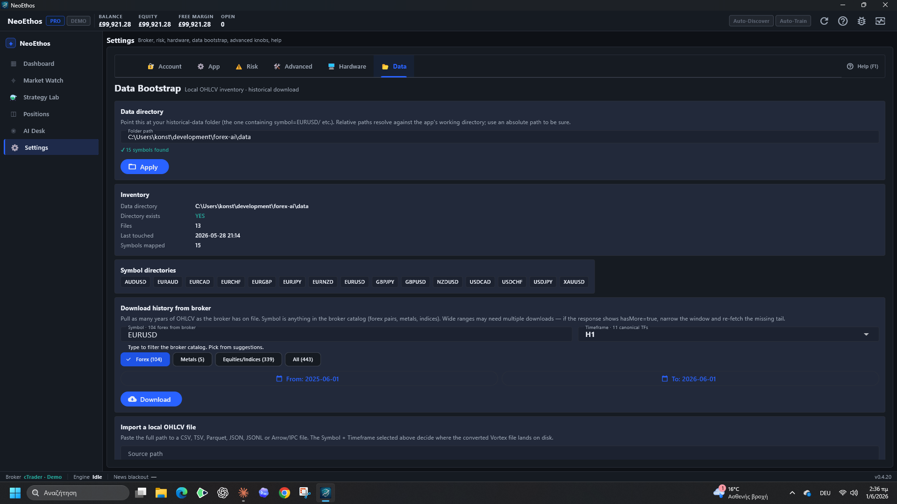
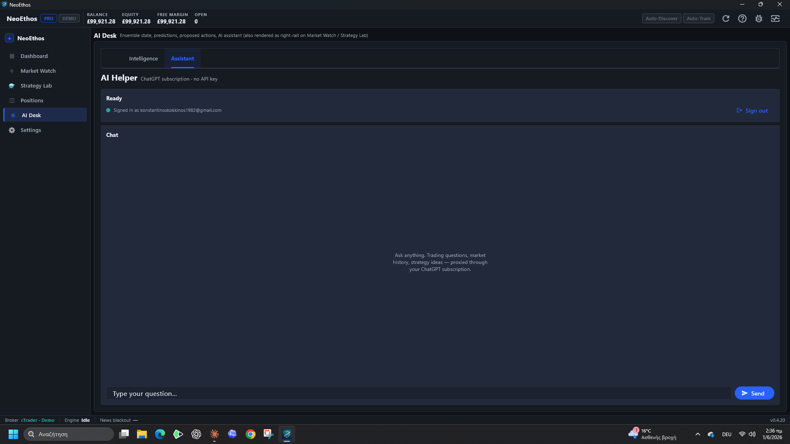

# NeoEthos v0.4.20

Desktop release of the NeoEthos / forex-ai trading workstation — pure-Rust
backend (cTrader Open API, GA discovery, ensemble inference) with a Flutter
desktop shell. Windows installer attached below.

This release closes the three operator-requested gaps for the live trading
desk and ships the fixes found by an exhaustive click-every-element pass.

## Highlights

### Multi-account picker (F-333)
The Settings → App tab now lists **every cTrader account** the OAuth token
grants — not just one. Demo (Spotware) and Live (e.g. FTMO) accounts are
shown with badges and the active account is selectable; the backend promotes
the chosen cTID to the front of `broker_credentials.toml` so the runtime
trades it on next start.

### Data directory, finally visible (F-332)
Settings → Data shows a prominent **Data directory** field with an Apply
button and a live "✓ N symbols found" readout, plus an Inventory panel
(directory, file count, symbols mapped) and the full symbol-directory list.
Pointing it at an absolute path (e.g. `…\forex-ai\data`) makes the backend
see the full local OHLCV set — charts and Discovery light up immediately.

### Inline buy/sell on the chart (F-334)
Click any symbol in Market Watch to open its chart. A compact one-click
**SELL [bid] · LOTS · BUY [ask]** strip sits just above the candles with a
live/stale freshness marker, so a quick trade needs zero typing. The full
Order Ticket remains for considered entries with custom SL/TP.

## Also in this release
- **AI Helper** (ChatGPT-subscription chat via Codex) — auth-schema +
  Responses-API fixes; verified end-to-end live.
- **Live spot stream** sends an app-level heartbeat, keeping Market Watch and
  chart prices flowing without the periodic "Bye" reconnect.
- **Strategy Lab Promotion Gate** — criteria breakdown + promote-to-live.
- GA/NeuroEvo/NEAT are strategy *discoverers*, not ensemble voters.

## Fixes found in QA (this release's exhaustive test pass)
Every element across all six tabs was clicked while reading the live backend
log. Three real bugs that "compiled clean" but broke at runtime were caught
and fixed:

- **Inline buy/sell was invisible** — it was a `Positioned` overlay inside the
  chart `Stack`, layered over a `CustomPaint(size: Size.infinite)`, so it never
  laid out. Moved into the chart's column flow; now always renders.
- **Quick-trade panel flickered** — it hid entirely whenever the tick aged past
  5 s (demo majors gap 15–20 s). Now it stays visible with an amber "stale Ns"
  marker, and an "awaiting price" stub when no tick exists yet.
- **AI Helper input was below the fold** — a MediaQuery-sized message box pushed
  the text field off-screen, forcing a scroll to type. The input is now pinned
  to the bottom with the message list filling the space above.

## Install (Windows)
1. Download `NeoEthos-Setup-0.4.20.exe`.
2. Double-click to install (silent `/S` also supported).
3. Launch from the Start Menu / Desktop shortcut.

On first launch, set Settings → Data → Data directory to your local OHLCV
folder, and Settings → App → Account to the cTrader account you want active.

## Screenshots
| | |
|---|---|
|  |  |
|  |  |
|  |  |

## Known notes
- Bundle omits the optional XGBoost expert (`xgboost.dll`) unless the Rust
  release is built with the `gpu-vulkan + tree-models` features; the ensemble
  runs without it.
- Account selection takes effect on next start (no runtime hot-swap yet).
